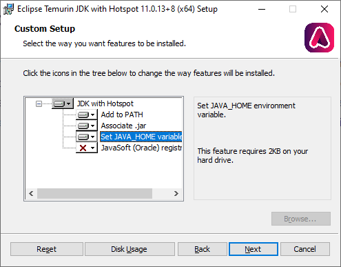

TomTom Digital Cockpit is written in 
[Kotlin](https://en.wikipedia.org/wiki/Kotlin_%28programming_language%29), which is designed to 
fully interoperate with the 
[Java virtual machine](https://en.wikipedia.org/wiki/Java_virtual_machine), by compiling to 
[Java bytecode](https://en.wikipedia.org/wiki/Java_bytecode). TomTom Digital Cockpit requires
[OpenJDK 11 (Open Java Development Kit)](https://en.wikipedia.org/wiki/OpenJDK), which is a free 
and open-source implementation of the Java Platform. Other OpenJDK versions may work, but have not 
been tested and will not be supported by TomTom.

## OpenJDK for Ubuntu

To install it, run the following command in a terminal:

```cmd
sudo apt install openjdk-11-jdk
```

You might already have other versions of JDK installed. Verify this by running:

```cmd
sudo update-java-alternatives -l
```

If you see the following output, then you only have OpenJDK and you are all set:

```cmd
java-1.11.0-openjdk-amd64      1111       /usr/lib/jvm/java-1.11.0-openjdk-amd64
```

If you see multiple Java versions in the output, you need to make sure you have the correct one set
as the default:

```cmd
sudo update-java-alternatives -s java-1.11.0-openjdk-amd64
```

Then you can verify that the correct Java version is in use by running:

```cmd
java --version
```

You should see output similar to this:

```cmd
openjdk 11.0.11 2021-04-20
OpenJDK Runtime Environment (build 11.0.11+9-Ubuntu-0ubuntu2.20.04)
OpenJDK 64-Bit Server VM (build 11.0.11+9-Ubuntu-0ubuntu2.20.04, mixed mode, sharing)
```

## OpenJDK for Mac

[Adoptium Temurin JDK](https://adoptium.net/?variant=openjdk11) Java version 11 can easily be
installed on Mac using [Homebrew](https://brew.sh/):

```cmd
brew tap AdoptOpenJDK/openjdk
brew install --cask adoptopenjdk11
```

Other alternatives of the OpenJDK can also be used, as long as they are Java version 11.

## OpenJDK for Windows

Download the OpenJDK installer from
[Adoptium Temurin JDK](https://adoptium.net/?variant=openjdk11):

- Select `Temurin 11 (LTS)` as Version.
- Click `Latest release` to start downloading the JDK file with `.msi` extension.
- Verify that the downloaded `.msi` file has `jdk` in its name, not `jre`.

Open the downloaded `.msi` file, to install the JDK:

- During installation, when you arrive at `Custom Setup` screen, press the cross next to
  `Set JAVA_HOME` settings and select: `Will be installed on local hard drive`.



- When finished installing, open the command prompt to make sure you are now using `OpenJDK 11`:

```cmd
    java -version
```

- You should see output similar to this:

```cmd
    openjdk version "11.0.13" 2021-10-19
    OpenJDK Runtime Environment Temurin-11.0.13+8 (build 11.0.13+8)
    OpenJDK 64-Bit Server VM Temurin-11.0.13+8 (build 11.0.13+8, mixed mode)
```

__Next step:__ 
[Accessing TomTom Digital Cockpit SDK Example Sources](/tomtom-digital-cockpit/documentation/getting-started/accessing-tomtom-digital-cockpit-sdk-example-sources)
