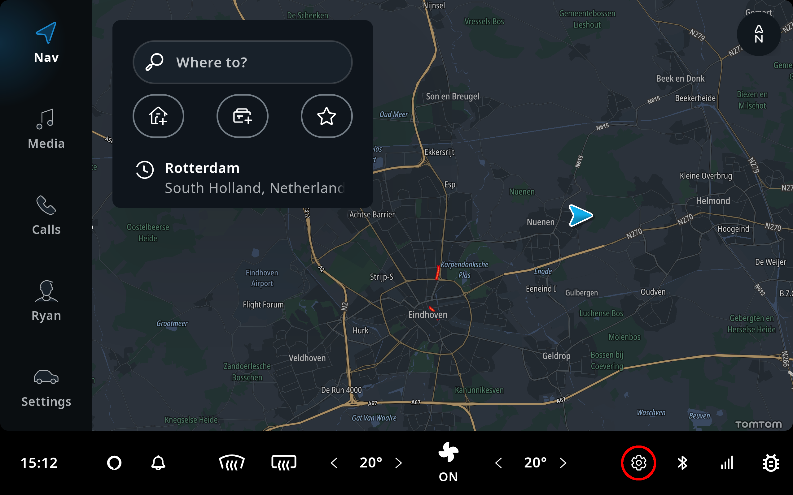
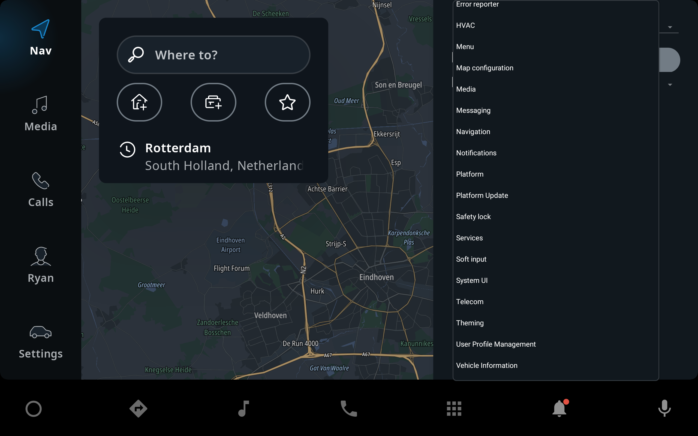
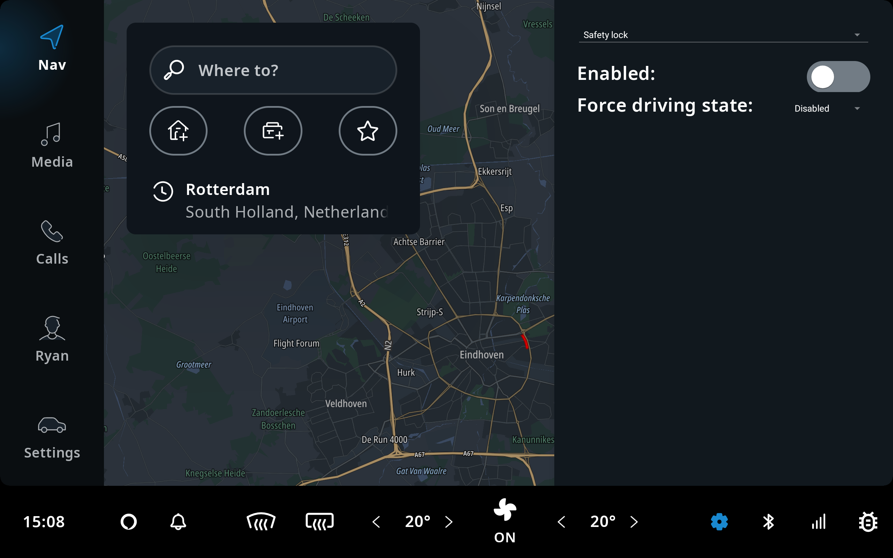

TomTom IndiGO provides a debug menu, giving access to functionality that is not normally available
to the end-user. This can be useful for developers to set the product up for testing, or for
accessing hidden features that aid development. For example: changing the
[Safety Lock](/tomtom-indigo/documentation/development/platform-features/safety-lock)
mode.

## Opening or Closing the Debug Menu

Opening the debug menu can be done in various ways:

- Press the "Settings" button in the system status panel, highlighted with a red circle:

    

- On the emulator, press the backtick ("\`") key on your keyboard.
- On a physical device, long press the "volume down" key.
- In a terminal, type `adb shell input keyevent KEYCODE_GRAVE`.

To close the debug menu, perform the same action again.

## Using the Debug Menu

The debug menu holds many tabs that allow you to tweak the TomTom IndiGO behavior while debugging
your implementation, or while exploring the
[Template Application](/tomtom-indigo/documentation/platform-overview/example-apps).

Press at the top of the debug menu to open the list of debug tabs, and select the one that you
need:

Each debug tab provides controls to tweak specific TomTom IndiGO aspects, for example to enable or
disable the
[Safety Lock](/tomtom-indigo/documentation/development/platform-features/safety-lock)
feature:

