TomTom IndiGO can run on Android emulators (Android Virtual Devices, AVDs) in addition to the 
reference or demo hardware (Samsung Galaxy Tab S5e). A special Android emulator configuration has 
been created for running TomTom IndiGO. This configuration contains a number of customizations to 
the emulator hardware and the Android platform on which it runs. This emulator can be used for 
development on top of TomTom IndiGO and runs x86\_64 AOSP with Android 11 Automotive.

__Note:__ The TomTom IndiGO platform also runs on a standard Android device, with a TomTom 
IndiGO-supported CPU architecture. However, some features may not work as TomTom IndiGO is 
implemented for the Android Automotive variant.

## The TomTom IndiGO emulator image

Follow these steps to install the TomTom IndiGO emulator image in Android Studio:

- Copy the file `docs/resources/devices.xml` (from the `examples` source), to your `~/.android/`
  folder.

    __Windows:__ Copy to your `%UserProfile%\.android\` folder.

- If Android Studio is running, restart it, so that the new file is picked up.

- Open the SDK Manager via `Tools` > `SDK Manager`.

- Select tab `SDK Update Sites` and add a new entry:
    - Name: `TomTom IndiGO - Android 11 Emulators`
    - URL: `https://aaos.blob.core.windows.net/indigo-automotive/repo-sys-img.xml`
    - Leave `Use Authentication` unchecked, and click `OK`.

- Add another `SDK Update Sites` entry:
    - Name: `TomTom IndiGO - Artifact Repository`
    - URL: `https://repo.tomtom.com/`
    - Tick `Use Authentication`, enter your TomTom
      [repository credentials](/indigo/documentation/getting-started/introduction)
      and click `OK`.

- __Note__ the `s` in `https://`, because Android Studio proposes a default URL as `http://`.

- Click `Apply` to activate these update sites.
    - The `TomTom IndiGO - Android 11 Emulators` entry should not show an error.
    - The `TomTom IndiGO - Nexus repository` entry will show an error, which you can ignore.

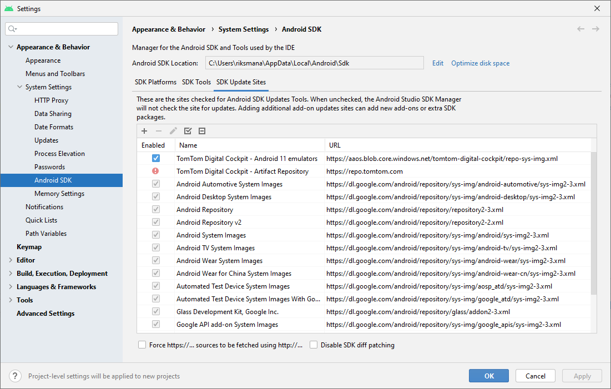

- Switch to tab `SDK platforms` and tick `Show Package Details` on the bottom right.

- Expand the `Android 11 (R)` section, enable the `Indigo Automotive Android System Image` and click
  `Apply` to start downloading this image.

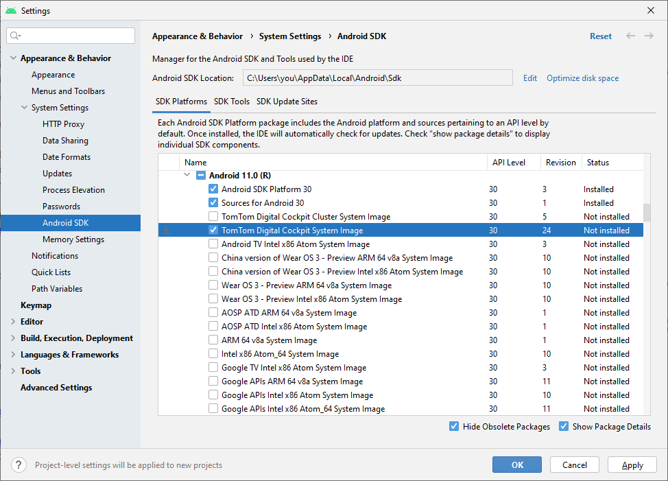

- When the download completes, click `Finish` and close the SDK Manager.

## The TomTom IndiGO emulator device

After having downloaded the [emulator image](#the-tomtom-indigo-emulator-image), you can create an
Android Virtual Device (AVD) with it:

- Open the AVD Manager via `Tools` > `AVD Manager`:

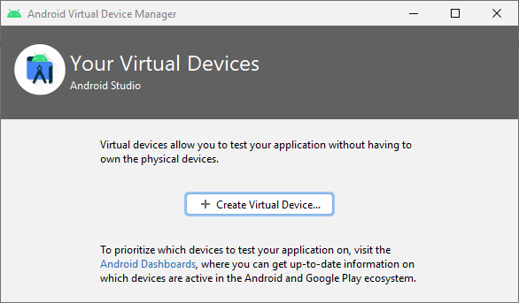

- Click `Create Virtual Device`. You should now see a list of device definitions.

- In the `Automotive` category, select item `IndiGO_Test_Device`, then click `Next`:

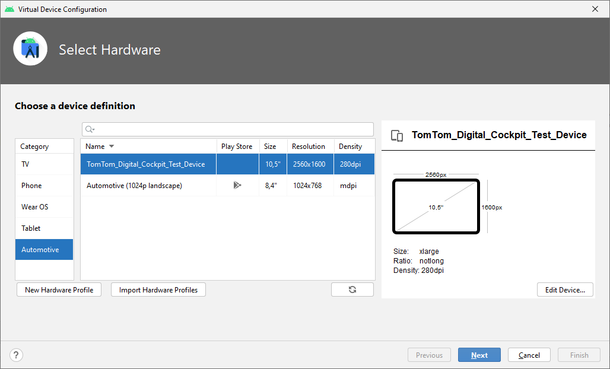

- In the `System Image` dialog, go to tab `x86 Images` and select the upper entry:
    - `Release Name` : `R`
    - `API level` : `30`
    - `ABI` : `x86_64`
    - `Target` : `Android 11.0 (Indigo Automotive Android System Image)`
    - __Note:__ The entries displayed differ only in the last part of their `Target` field.

- __Mac _with_ an M1 processor:__ Go to tab `Other Images` and select `Android S` for `arm64-v8a` as
  the System Image. This is a standard Android image, without TomTom IndiGO-specific customizations 
  or Android Automotive features!

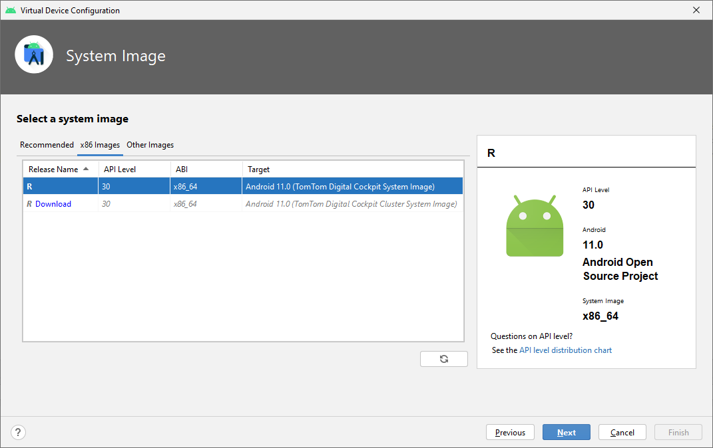

- Click `Next`. Then, in the `Verify Configuration` dialog, click `Show Advanced Settings` and
  scroll down to the `Memory and Storage` section. Ensure these fields have at least the following
  values:
    - `RAM` : `3072 MB`
    - `VM heap` : `192 MB`
    - `Internal Storage` : `2048 MB`

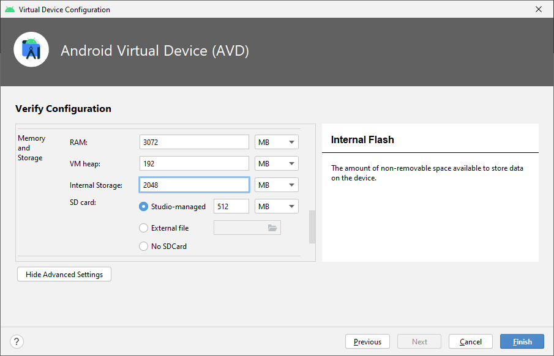

- Click `Finish`.

- You now see a new TomTom IndiGO emulator device listed in the AVD Manager:

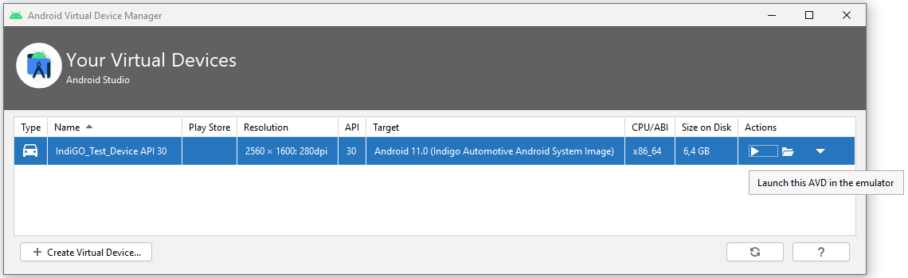

- Click the triangular `play` icon on the right to start the emulator.
- When the emulator has started, it shows as:

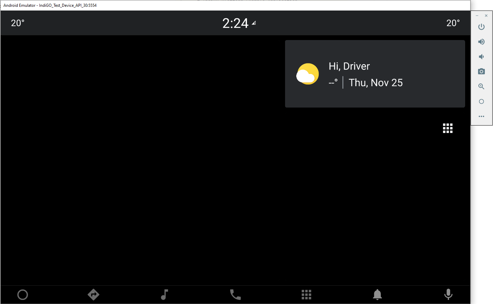

- Enable wifi, to ensure that map data can be downloaded:
    - Click the Home button (circle) in the sidebar next to the emulator screen.
    - Press the Android Applications icon (nine dots in a grid) on the bottom of the screen.
    - Scroll down and open `Settings`.
    - Select `Network & internet`.
    - Enable `Wi-Fi` by pressing the toggle button so it turns blue.

- Set the emulator's OpenGL ES API level to 3.1:
    - Click the three dots at the bottom in the sidebar next to the emulator screen. This opens the
      `Extended Controls` dialog.
    - Select `Settings` at the left.
    - Select the `Advanced` tab at the top.
    - This should say `Desktop native OpenGL` and `Renderer maximum (up to OpenGL ES 3.1)`, see
      picture below.
    - Close the `Extended Controls` dialog.

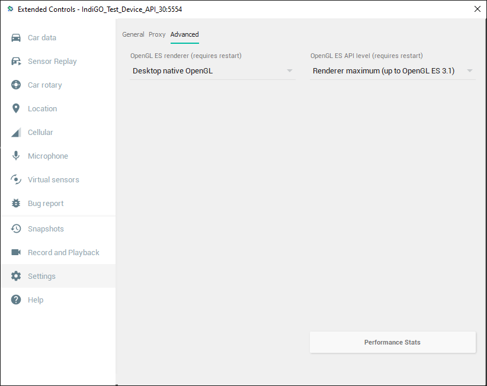

- Now restart the emulator, for the new settings to take effect:
    - Click the `x` in the upper-right corner of the emulator sidebar.
    - In Android Studio go to: `Tools` > `AVD Manager`.
    - On the right-hand side of each configured AVD there is a down-arrow that opens a context menu.
      Press the down-arrow (instead of pressing the green Play button), and select `Cold Boot Now`.

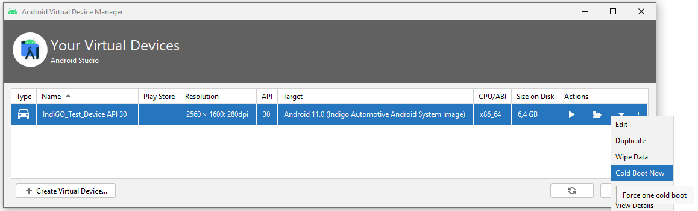

- Close the AVD Manager and wait for the emulator to start up.

- In Android Studio, build and run the application by clicking on the green `play` icon. Select the
  TomTom IndiGO automotive emulator that was created earlier in this tutorial, as the device that 
  the application will run on:

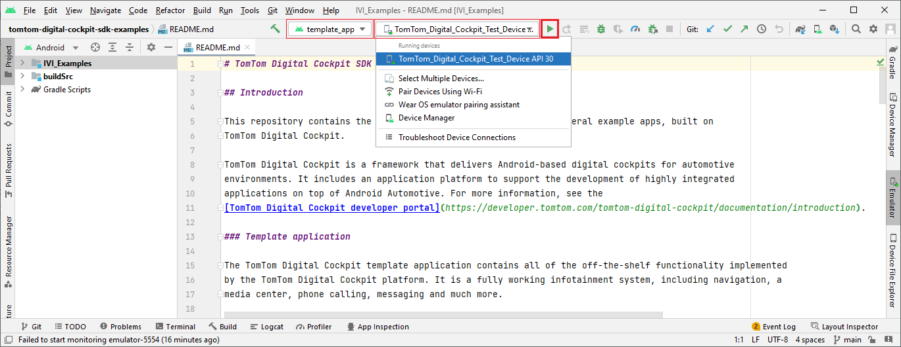

- When the application starts, you must select `IVI Example` as the default phone app.

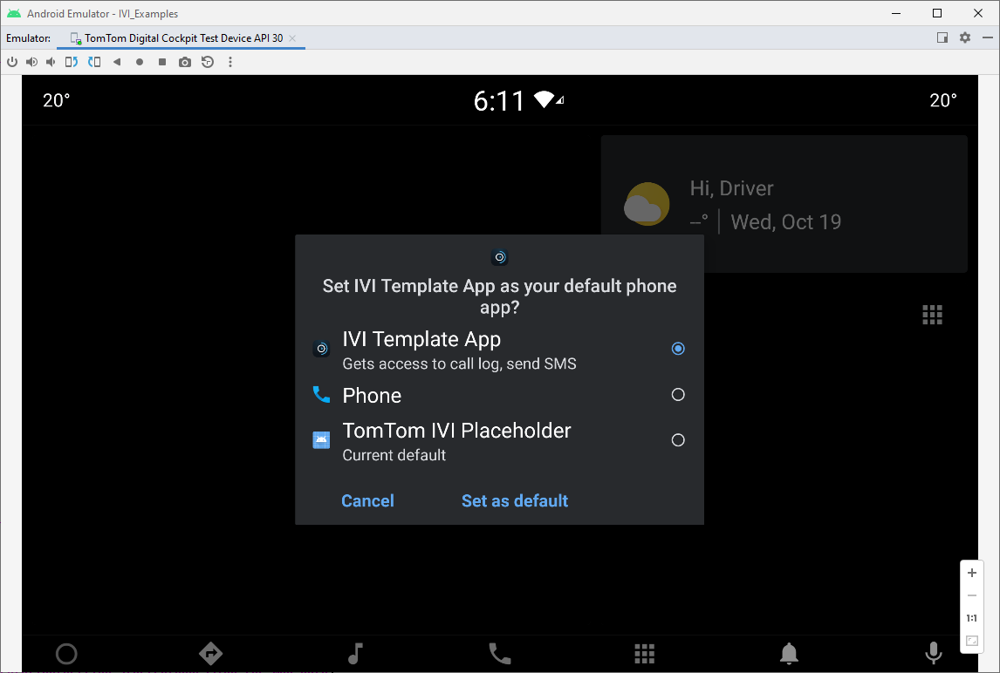

- You will now see the TomTom IndiGO home screen. Note that the map data is shown only when you have
  [configured a valid TomTom API key](/indigo/documentation/getting-started/getting-the-tomtom-api-key).

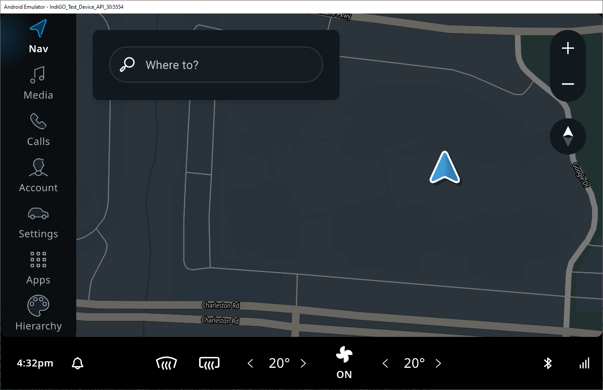

If you encounter any issues, please consult our
[Frequently Asked Questions](/indigo/documentation/getting-started/frequently-asked-questions-faq).
