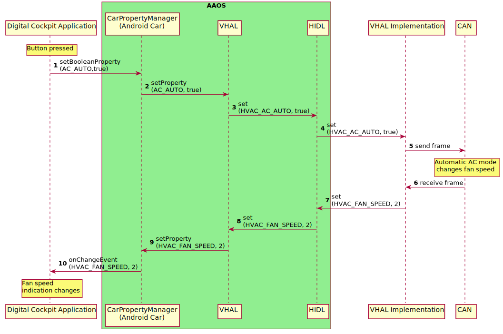

When a head unit runs Android Automotive OS (AAOS) it needs to communicate with the vehicle it is
installed in. This happens through the car API of AAOS, which makes it possible to access vehicle
properties. When these properties change, the UI can be adjusted accordingly. Similarly when the UI
controls are operated by the user, the new property value can be communicated to the vehicle.

Read more about [AAOS and vehicle integration](https://source.android.com/docs/devices/automotive).

## Integrating TomTom IndiGO into the vehicle

When the APK is installed on a head unit, it needs to get information from the vehicle and send
information to the vehicle.

- __TomTom IndiGO Application__: Android Automotive based infotainment system,
  along with an application suite providing common functionality.
- __Android Automotive OS__: Google’s operating system for connected in-vehicle infotainment (IVI)
  systems.
- __VHAL__: The Vehicle Hardware Abstraction Layer is an abstract interface allowing the Android
  system to communicate with vehicle-specific hardware. The interface is defined using HAL Interface
  Definition Language ([HIDL](https://source.android.com/devices/architecture/hidl)).
  It describes the communication with the in-vehicle networks (IVN). Data is transferred using
  `VehiclePropValues`.
- __VHAL Implementation__: A vendor/vehicle specific implementation of the VHAL interface. It is
  typically implemented in C/C++ using native APIs generated by the Android build system from VHAL
  HIDL.
- __Vehicle data__: Data coming in from the vehicle sensors.

## Signal transfer

The vehicle data used by the application is abstracted from AAOS by the use of the TomTom IndiGO 
module, specifically by the use of [`VehicleProperties`](TTIVI_INDIGO_API).
These properties hold the current status of the different data values. A value can be changed by the
application, when the user operates a control, or by the vehicle when the data in the vehicle
changes.

The vehicle data must be mapped to these [`VehicleProperties`](TTIVI_INDIGO_API). This means that 
the data (for example CAN data) is mapped to a vehicle property and sent to the
[VHAL](https://source.android.com/devices/automotive/vhal) of AAOS. For this a native system service
can be used that receives the vehicle signal, converts it to a [VehicleProperties](TTIVI_INDIGO_API) 
value and sends it to Android. To do that, HIDL must be used, because it can be versioned, in 
contrast to the C/C++ implementations of drivers and JNI interfacing, which was common before 
Android 8.

- __CarPropertyManager__: Provides a Java API to access VHAL properties.
- __HIDL__: The HAL Interface Definition Language is used within the Hardware Abstraction Layer to
  define the interfaces describing the individual hardware devices that are used in combination with
  Android.
- __CAN__: The Controller Area Network (CAN) is a network designed to allow micro controllers and
  devices to communicate with each other without the need for a host computer.

For more information about HIDL interfaces and the CAN see:
- [HIDL in C++](https://source.android.com/devices/architecture/hidl-cpp)
- [CAN Bus Explained](https://www.csselectronics.com/pages/can-bus-simple-intro-tutorial)
