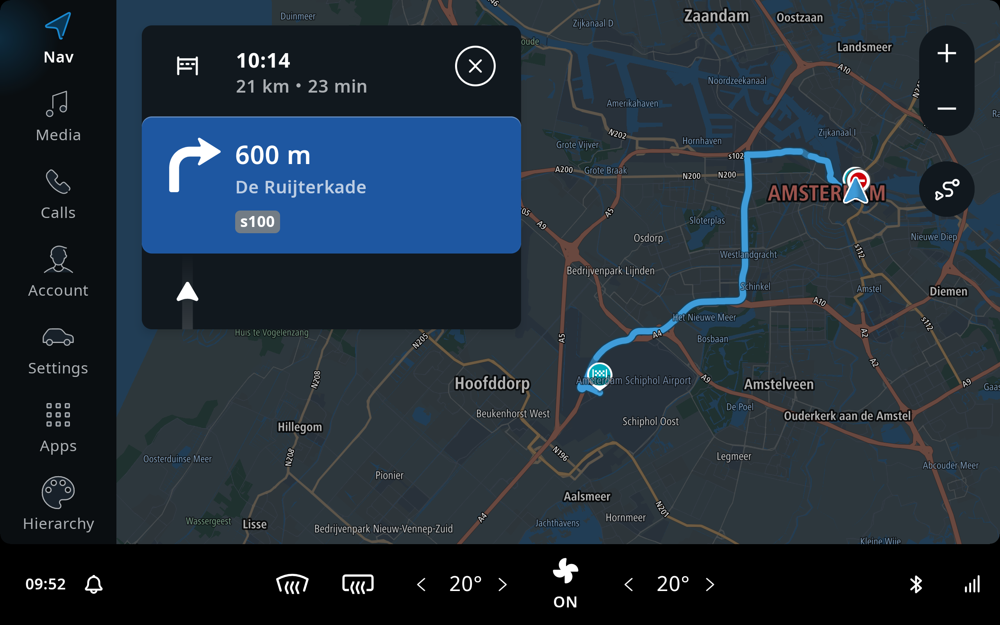
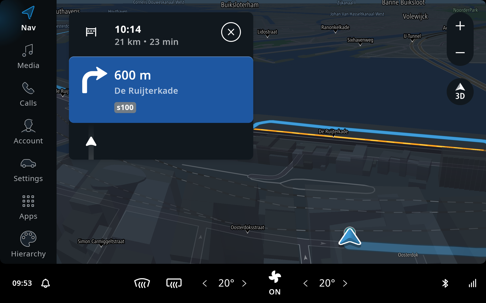
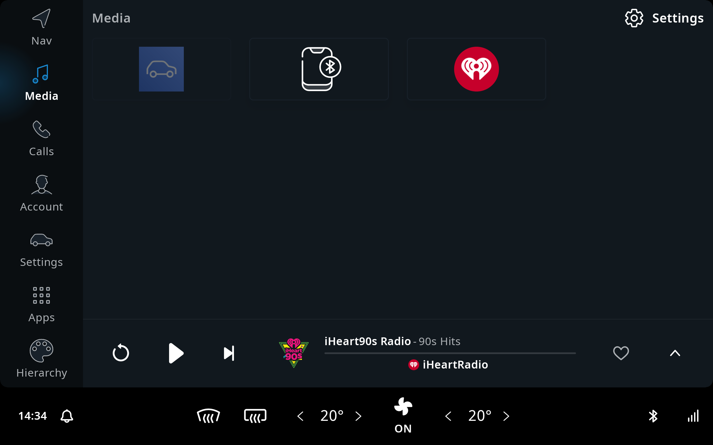
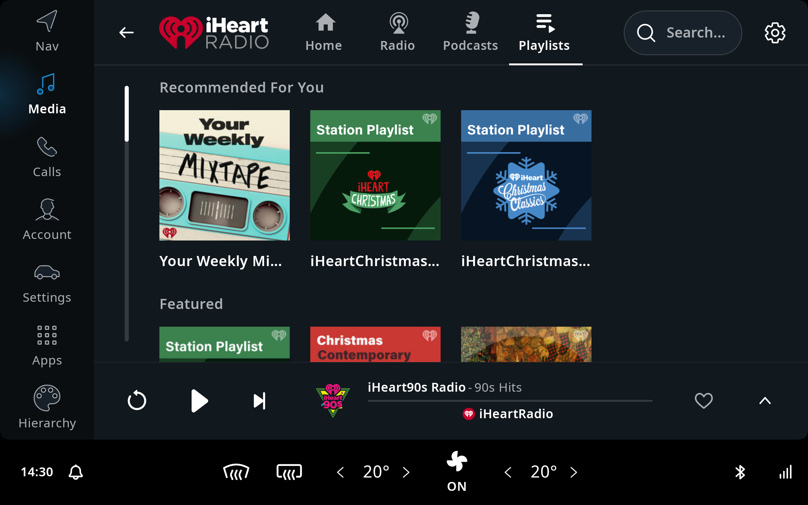
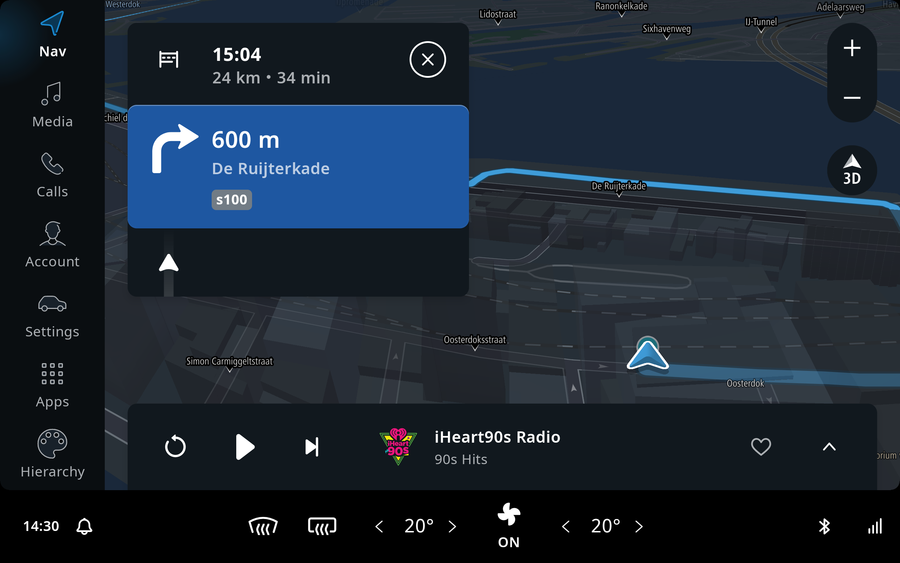
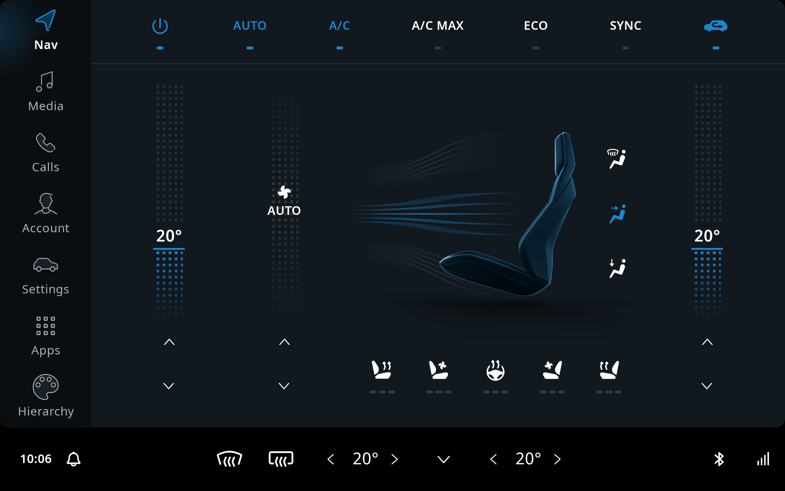
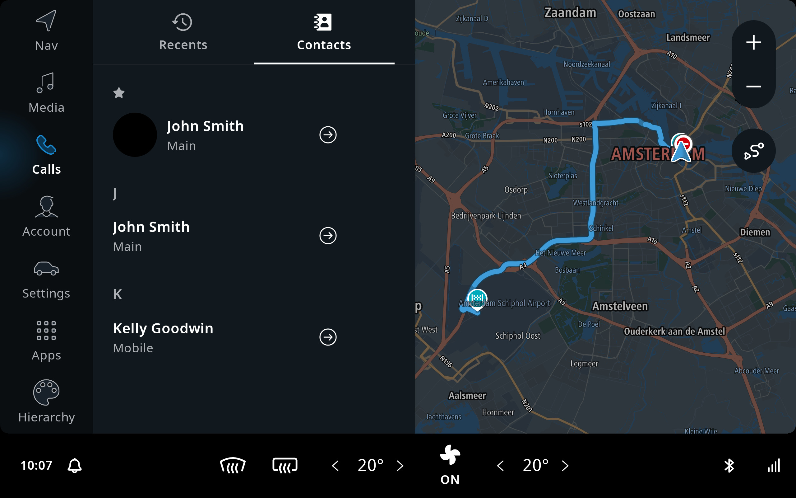
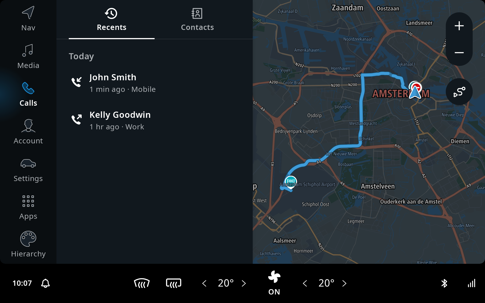
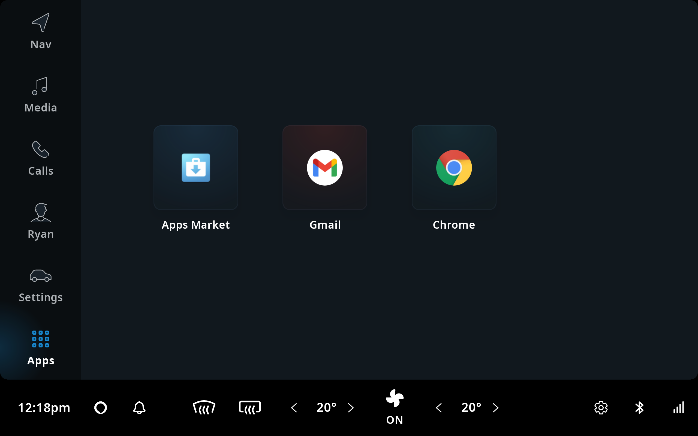
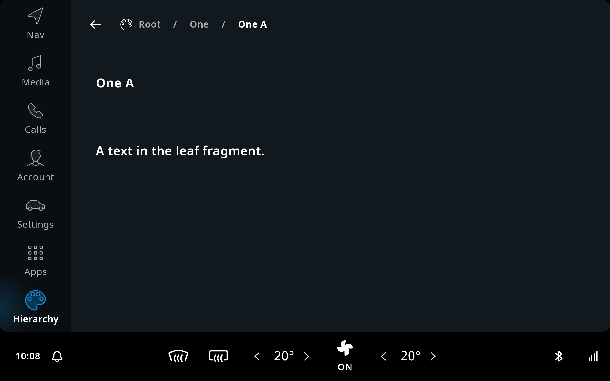

The TomTom IndiGO SDK comes with a template application and a set of example applications.

The template application demonstrates the
[_off-the-shelf_](/tomtom-indigo/documentation/development/introduction#off-the-shelf-components-or-stock-components)
functionality of the TomTom IndiGO platform. This can be a good starting point for your own
application, where you implement your own features and customizations.

The example applications help you get started with developing for TomTom IndiGO. These
applications are introduced in the
[Example apps](#example-apps) section, and explained in more detail in the
[Tutorials and Examples](/tomtom-indigo/documentation/tutorials-and-examples/overview) section.

## Off-the-shelf functionality

The TomTom IndiGO template application contains all of the
[_off-the-shelf_](/tomtom-indigo/documentation/development/introduction#off-the-shelf-components-or-stock-components)
functionality implemented for the TomTom IndiGO platform. It is a fully working infotainment
system, including navigation, a media center, phone calling, messaging and much more. In the
source code the _off-the-shelf functionality_ is often referred to as _stock functionality_.

This walk-through of the IndiGO platform functionality is using the template application, which can be found
in the `template/app` directory.

The default view, when starting the application, looks like this.

The contents of the map view will vary depending on your current location.
The screen of the TomTom IndiGO system is divided into a few different areas. The background
contains the map, which provides navigation functionality, with search, route guidance, traffic
information and so on. The main menu is on the left-hand side, which allows access to other
functionality of the platform and ability to always return to navigation. Along the bottom there
is a statusbar, including the Climate Control Center, which contains the Heating, Ventilation,
and Air conditioning (HVAC) controls.

### Navigation

The default view in the TomTom IndiGO product shows navigation functionality with the current
location on the background map. The map is interactive and you can pan, zoom and switch between the
2D overview mode and the 3D navigation view. To navigate to a location, you can either search for it
through the search box at the top of the screen, or simply select a location on the map with a long
press.

A planned route to Schiphol airport in Amsterdam, with the guidance panel enabled, showing
guidance instructions for the drive, looks like this:

And here we have the same route, with the map in 3D mode instead.

### Media

The media application in TomTom IndiGO provides a framework for browsing and controlling audio
content, provided by third-party media sources. The media source view in the media application lists all the
currently available media sources on the device. You can see iHeartRADIO as a third-party media source on
the device, and a paired mobile phone for BT audio streaming.

Each media source makes use of the same playback controls, which show the currently playing content
at the same location of the screen. The user can therefore control what is playing, regardless of
whether the user is browsing (other) media content, or not.

When audio is playing and the user is back in the home screen, media controls are visible at the
bottom of the screen. This is called the Mini Player and allows users to control audio during
driving, whilst using active guidance. The Mini Player is dismissed automatically, a little while
after media playing has stopped.

### Climate Control

Climate control in the car is usually referred to as _HVAC_ (heating, ventilcation and air conditioning).
Since HVAC functionality can differ a lot between OEMs, the TomTom IndiGO platform comes with a
reference implementation, providing functionality for many common HVAC requirements. This can be used
as a starting point to implement additional functionality for the relevant car model. The reference
implementation is wired up to the Vehicle Hardware Abstraction Layer (VHAL) in the Android Automotive
platform.

The reference implementation can be launched by touching the climate control area in the status bar
at the bottom of the screen, called the _Climate Control Center_. The most common HVAC
functionalities, like changing the temperature, can also be accessed through the Climate Control
Center directly, without having to launch the application first.

### Calls application

The calls application in TomTom IndiGO, provides functionality to make and receive phonecalls
through a mobile phone that is paired to TomTom IndiGO via Bluetooth. Once a mobile phone is
paired, the contact list will sync with the TomTom IndiGO IVI system. Then the contacts will be
accessible under the _Contacts_ tab, which allows the user to select a contact and make a
phonecall.

The most recent phonecalls will also sync across from the Bluetooth-connected mobile phone. If the user
disconnects the BT connection to the mobile, all synchronized information will be hidden in the UI
to ensure privacy.

### Apps

The _Apps_ tab provides an _overflow_ panel which allows access to any additional applications that
do not fit within the main menu.

TomTom IndiGO supports integration of Android app stores and the _Apps_ tab can be configured to
display the app store of your choice. This tab also contains any Android apps installed from the app
store as well as any other application that is installed outside of the system image.

You can read more about how to configure an app store of your choice in
[this section](/tomtom-indigo/documentation/tutorials-and-examples/setup/configure-an-app-store).

Picture showing the _Apps_ tab with an app store configured and some third-party apps installed:

## Example Apps

The example applications contain all of the
[_off-the-shelf_](/tomtom-indigo/documentation/development/introduction#off-the-shelf-components-or-stock-components)
functionality of the template application. On top of this, they also contain code demonstrating how to
implement and integrate specific features into the TomTom IndiGO platform. Each example is
explained and documented in the
[Tutorials and Examples](/tomtom-indigo/documentation/tutorials-and-examples/overview) section.

For example, to get you started with making your own TomTom IndiGO “application”, there are two examples
that explain how to
[create a new frontend](/tomtom-indigo/documentation/tutorials-and-examples/basics/create-a-frontend-plugin)
for the UI, along with an
[IVI service](/tomtom-indigo/documentation/tutorials-and-examples/basics/create-an-ivi-service)
to implement the logic serving that UI.
These two components together implement an example for displaying account details. The example replaces
the default stock implementation of the TomTom IndiGO user profile frontend, with the new functionality.
The source code can be found in: `examples/plugin/app`.

There is also an example of how to create a hierarchy of panels within a frontend, and the use of
the [TtNavigationBar](TTIVI_ANDROID_TOOLS_API) at the top to display breadcrumbs to simplify
navigation between hierarchies. The example source is in `examples/panelhierarchy/` in the
example app.

## Debug menu

The template app and the example apps also give access to the
[Debug Menu](/tomtom-indigo/documentation/getting-started/the-debug-menu),
which allows you to tweak the TomTom IndiGO behavior.
