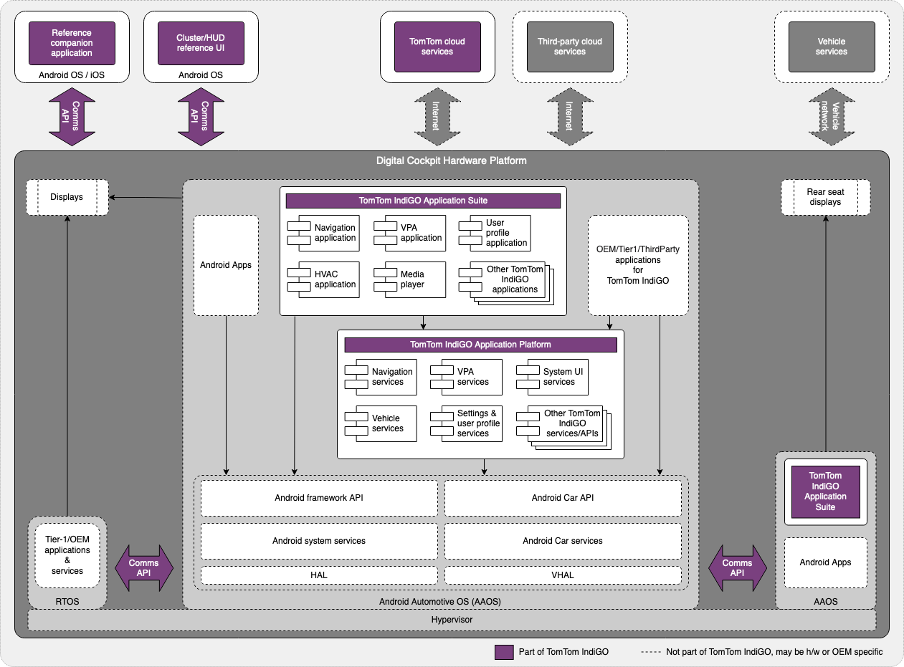

TomTom IndiGO is a framework to develop Android-based digital cockpits. It includes an application
platform to support the development of highly integrated applications on top of Android
Automotive. It also offers a complete set of industrial strength end-user applications, that can
be customized to the needs of any car maker.

TomTom IndiGO offers a fully customizable system UI, which allows applications to work together in
a more integrated way than the standard Android application-switching system UI does. Individual
applications are not just visually seamlessly integrated, they work together to provide
a single, consistent, cohesive and task-oriented user experience for the end-user, without moving
from one app to another.

## Off-the-shelf included components

TomTom IndiGO comes standard with a comprehensive set of automotive grade services and
applications, ready to be used for commercial purposes. We call these the
[_off-the-shelf components_](/tomtom-indigo/documentation/development/introduction#off-the-shelf-components-or-stock-components).

Off-the-shelf applications can be used “plug-and-play” or they can be customized to the
car maker’s needs. Performing customization is not limited to visual changes, but may also include
modified or added features. And using the extensive set of TomTom IndiGO platform APIs, which
extend the standard Android Automotive APIs, new applications can be added with much less effort
compared to standard Android Automotive development.

## Building your first TomTom IndiGO product

When the TomTom IndiGO product is built, it assembles the application platform components and the
off-the-shelf applications in the application suite, into an Android APK. This is the application
that fully controls the center console, typically positioned between the driver and the front-seat
passenger. It optionally also provides information to the cluster display, the display usually
positioned directly in front of the driver.

This diagram shows how TomTom IndiGO fits in a digital cockpit system and how it relates to other
software in a vehicle. It shows some of the off-the-shelf components in the application suite and
platform.

The TomTom IndiGO SDK includes a template app that integrates the TomTom IndiGO platform with all
of its
[off-the-shelf functionality](/tomtom-indigo/documentation/platform-overview/example-apps#off-the-shelf-functionality).
The template app is a fully working In-Vehicle Infotainment system (IVI), including phone calling,
contacts handling, messaging, notifications, multimedia, navigation and much more, all
production-level code. All of the applications included in that template application belong to the
top of the diagram, in the section “TomTom IndiGO Application Suite”. The
[Getting Started Guide](/tomtom-indigo/documentation/getting-started/introduction)
explains step-by-step how to set up your development environment to build the template application
and the example applications.

## Using off-the-shelf components to assemble your product

When you look at the source code of the IVI Template App, you will notice the Kotlin code for the
product is really just a couple of lines of code. Most of the work is done by a Gradle build file
that pulls in all the off-the-shelf components that provide the actual functionality of the
application. In the diagram, these off-the-shelf components are the modules (or _puzzle pieces_) in
the blocks “TomTom IndiGO Application Suite” and “TomTom IndiGO Application Platform”.

Forking and building the IVI Template App is a great way to start development of a new IVI system.
It gets you up and running really fast. From there on, you can easily modify or add any puzzle
piece you need and you’ll have a working system from day one.

## Customizing off-the-shelf components to match your needs

Let’s look a bit closer at how to customize an _off-the-shelf application_. There are many more
modules than shown in the previous diagram, and many applications contain both a User Interface (UI)
module and a application logic module (an _application service_). Suppose you wish to make the
Communications application that provides phone calling look or behave differently. TomTom provides
off-the-shelf versions of these puzzle pieces in an external binary repository that you would use to
pull these puzzle pieces from.

The User Interface (UI) component contains only the user interface: the graphics, the buttons and
the connection to the application service that implements the functionality, such as calling a
phone number. The _application service_ contains the application logic. It knows how to do things,
but it leaves what that looks like to the _UI component_. Together these two components make up
the Communications application.

Now, if you want to just change what the application looks like, you just have to provide an
alternative UI puzzle piece to your application. You can still pull the “app service” from the
TomTom Nexus repository. This means you can also automatically get the latest version of the “app
service”, even if you modified the UI. That is really useful for staying up-to-date with your
applications.

Should you want to change or add functionality to the application, then you need to customize the
“app service” and provide it yourself. In that case, you can use the source code of the provided
service or application as a starting point.
All of the other apps would still be pulled from our Nexus and you can still benefit from
the automatic updates for those. That is a powerful way of completely customizing the look and feel
of applications, with limited effort.

For a more detailed view of the TomTom IndiGO platform, please see the
[Development](/tomtom-indigo/documentation/development/introduction) section.
