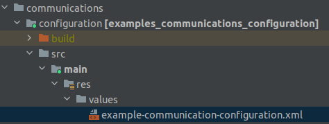

The off-the-shelf communications plugin comes with default configuration. This configuration provides a
default behavior, such as closing the frontend when making an outgoing call. This configuration 
is based on the [configuration-framework](/tomtom-indigo/documentation/tutorials-and-examples/customization/use-the-configuration-framework).
and can be changed if necessary. This guide explains this procedure.

- The communications plugin default configuration [Default communications plugin configuration](communications-plugin-default-configuration)
- Change the communications plugin configuration [Change the communications plugin configuration](change-the-communications-plugin-configuration)

## communications plugin default configuration

The communications plugin default configuration is defined as a resource file that contains configuration 
keys and their values. The following keys and values are defined in the communications plugin:

```xml
<resources>
    <!--Indicates that the communications panel will be kept open when starting an outgoing call. By default it is set to false-->
    <bool name="keepCommunicationsPanelOpenOnOutgoingCallConfigKey">false</bool>
</resources>
```

## Change the communications plugin configuration

The communications plugin default configuration can be changed by adding a custom configuration resource file
in your application, such as `<module>/res/value/example-communications-configuration.xml`. 



The custom configuration overrides the default values with the one provided.

## Configure the behaviour of frontend whe making an outgoing call

When an outgoing call is made, the communications frontend will closed by default. 

If you don't want to close the frontend provided with the off-the-shelf communications plugin, you 
can configure it by setting the
`keepCommunicationsPanelOpenOnOutgoingCallConfigKey` to `true`: 

```xml 
<bool name="keepCommunicationsPanelOpenOnOutgoingCallConfigKey">true</bool>
```
