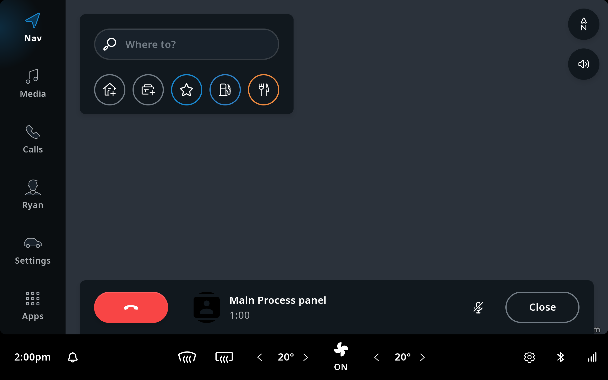

---  
title: Create a Main Process Panel
---  

A [`MainProcessPanel`](TTIVI_INDIGO_API) is a panel that is used to visualize the state of an
ongoing process. And like any panel, it needs an [`IviFragment`](TTIVI_INDIGO_API) and a 
[`FrontendViewModel`](TTIVI_INDIGO_API) to be created.

By extending [`MainCompactProcessFragment`](TTIVI_INDIGO_API) and 
[`MainCompactProcessViewModel`](TTIVI_INDIGO_API), you get a default template for the panel. 
Alternatively, you can still extend [`IviFragment`](TTIVI_INDIGO_API) and
[`FrontendViewModel`](TTIVI_INDIGO_API) from scratch to have a custom panel layout. For more 
information and details about the template look and feel, and the elements which compose the layout,
please check
[Main process panel](/tomtom-indigo/documentation/design/system-ui/main-process-panels).

The following sections explain how to add a [`MainProcessPanel`](TTIVI_INDIGO_API) similar to the
`CallMainProcessPanel` implemented by the communication frontend in TomTom IndiGO. An example app is
provided in the 
[`examples/processpanel/mainprocesspanel`](https://github.com/tomtom-international/tomtom-indigo-sdk-examples/tree/main/examples/processpanel/mainprocesspanel)
directory.

## Create a main process panel for calling

In this example, we will create _ExampleCallMainProcessPanel_ using the process panel template 
offered by extending the [`MainCompactProcessFragment`](TTIVI_INDIGO_API) and 
[`MainCompactProcessViewModel`](TTIVI_INDIGO_API). To do so, we need to create the following 
classes:

- [`ExampleCallMainProcessPanel`](#create-the-panel-class).
- [`ExampleCallMainProcessFragment`](#create-the-fragment-class).
- [`ExampleCallMainProcessViewModel`](#create-the-viewmodel-class).
- [`ExampleCallMainProcessViewModelFactory`](#create-the-viewmodel-factory-class).

### Create the panel class

First, add the _CompactProcessPanel_ dependencies to the
[`/build-logic/libraries.versions.toml`](https://github.com/tomtom-international/tomtom-indigo-sdk-examples/blob/main/build-logic/libraries.versions.toml#L43)
file:

```toml
indigoPlatformFrontendApiTemplateCompactProcessPanel = { module = "com.tomtom.ivi.platform:platform_frontend_api_template_compactprocesspanel", version.ref = "indigoPlatform"}
```

Then, create an `ExampleCallMainProcessPanel` class, extended from `MainProcessPanel`:

[`src/main/kotlin/com/example/ivi/example/processpanel/mainprocesspanel/examplecallmainprocesspanel/ExampleCallMainProcessPanel.kt`](https://github.com/tomtom-international/tomtom-indigo-sdk-examples/blob/main/examples/processpanel/mainprocesspanel/src/main/kotlin/com/example/ivi/example/processpanel/mainprocesspanel/examplecallmainprocesspanel/ExampleCallMainProcessPanel.kt#L18-L25)

```kotlin
import com.tomtom.ivi.platform.frontend.api.common.frontend.FrontendContext
import com.tomtom.ivi.platform.frontend.api.common.frontend.IviFragment
import com.tomtom.ivi.platform.frontend.api.common.frontend.panels.MainProcessPanel

internal class ExampleCallMainProcessPanel(
    frontendContext: FrontendContext,
    val dismiss: () -> Unit
) : MainProcessPanel(frontendContext, Priority.HIGH) {

    override fun createInitialFragmentInitializer() =
        IviFragment.Initializer(ExampleCallMainProcessFragment(), this)
}
```

### Create the fragment class

Create an `ExampleCallMainProcessFragment` class, derived from `MainCompactProcessFragment`:

[`src/main/kotlin/com/example/ivi/example/processpanel/mainprocesspanel/examplecallmainprocesspanel/ExampleCallMainProcessFragment.kt`](https://github.com/tomtom-international/tomtom-indigo-sdk-examples/blob/main/examples/processpanel/mainprocesspanel/src/main/kotlin/com/example/ivi/example/processpanel/mainprocesspanel/examplecallmainprocesspanel/ExampleCallMainProcessFragment.kt#L18-L19)

```kotlin
import com.tomtom.ivi.platform.frontend.api.template.compactprocesspanel.MainCompactProcessFragment

internal class ExampleCallMainProcessFragment : MainCompactProcessFragment
<ExampleCallMainProcessPanel, ExampleCallMainProcessViewModel>(ExampleCallMainProcessViewModel::class)
```

### Create the ViewModel class

Create an `ExampleCallMainProcessViewModel` class, derived from `MainCompactProcessViewModel`:

[`src/main/kotlin/com/example/ivi/example/processpanel/mainprocesspanel/examplecallmainprocesspanel/ExampleCallMainProcessViewModel.kt`](https://github.com/tomtom-international/tomtom-indigo-sdk-examples/blob/main/examples/processpanel/mainprocesspanel/src/main/kotlin/com/example/ivi/example/processpanel/mainprocesspanel/examplecallmainprocesspanel/ExampleCallMainProcessViewModel.kt#L22-L39) 

```kotlin
import androidx.lifecycle.viewModelScope
import com.example.ivi.example.processpanel.mainprocesspanel.R
import com.tomtom.ivi.platform.framework.api.common.annotations.IviExperimental
import com.tomtom.ivi.platform.frontend.api.template.compactprocesspanel.MainCompactProcessViewModel
import com.tomtom.tools.android.api.resourceresolution.string.ResourceStringResolver
import kotlinx.coroutines.launch

@OptIn(IviExperimental::class)
internal class ExampleCallMainProcessViewModel(panel: ExampleCallMainProcessPanel) :
    MainCompactProcessViewModel<ExampleCallMainProcessPanel>(panel) {
    private val factory =
        ExampleCallMainProcessViewModelFactory(
            title = ResourceStringResolver(R.string.ttivi_processcreation_mainprocesspanel_title),
            doDismissCall = ::closePanel,
            doEndCall = ::closePanel
        )
    override val primaryControlsViewModel = factory.createPrimaryControls()
    override val metadataViewModel = factory.createMetadata()
    override val secondaryControlsViewModel = factory.createSecondaryControls()

    private fun closePanel() {
        viewModelScope.launch {
            panel.dismiss()
        }
    }
}
```

### Create the ViewModel factory class

Creating the `ExampleCallMainProcessViewModelFactory` class is optional. Still, it is a good 
practice to have a central place responsible for creating the 
[`CompactProcessViewModel`](TTIVI_INDIGO_API) ViewModels.

In this code snippet, we will provide ViewModels for the primary control section, secondary control 
section, and Metadata section.

[`src/main/kotlin/com/example/ivi/example/processpanel/mainprocesspanel/examplecallmainprocesspanel/ExampleCallMainProcessViewModelFactory.kt`](https://github.com/tomtom-international/tomtom-indigo-sdk-examples/blob/main/examples/processpanel/mainprocesspanel/src/main/kotlin/com/example/ivi/example/processpanel/mainprocesspanel/examplecallmainprocesspanel/ExampleCallMainProcessViewModelFactory.kt#L34-L117)

```kotlin
import androidx.lifecycle.LiveData
import androidx.lifecycle.map
import com.example.ivi.example.processpanel.mainprocesspanel.R
import com.tomtom.ivi.platform.frontend.api.template.compactprocesspanel.CompactProcessControlViewModel
import com.tomtom.ivi.platform.frontend.api.template.compactprocesspanel.CompactProcessMetadataViewModel
import com.tomtom.tools.android.api.livedata.ImmutableLiveData
import com.tomtom.tools.android.api.resourceresolution.drawable.ResourceDrawableResolver
import com.tomtom.tools.android.api.resourceresolution.string.ResourceStringResolver
import com.tomtom.tools.android.api.resourceresolution.string.StaticStringResolver
import com.tomtom.tools.android.api.resourceresolution.string.StringResolver
import com.tomtom.tools.android.api.uicontrols.compositeviewmodel.StockVisibilityProvidingCompositeViewModel
import com.tomtom.tools.android.api.uicontrols.compositeviewmodel.VisibilityProvidingCompositeViewModel
import com.tomtom.tools.android.api.uicontrols.imageview.ImageDescriptor
import com.tomtom.tools.android.api.uicontrols.imageview.ImageType

internal class ExampleCallMainProcessViewModelFactory(
    private val title: StringResolver,
    doEndCall: () -> Unit,
    doDismissCall: () -> Unit,
) {
    // Add your implementation for the end call control button.
    private val endCallControl = CompactProcessControlViewModel()

    // Add your implementation for the mute control button.
    private val toggleMuteControl = CompactProcessControlViewModel()

    // Add your implementation for the close control button. 
    private val closeControl = CompactProcessControlViewModel()

    // Return a list of the primary section ViewModels. 
    fun createPrimaryControls():
        LiveData<VisibilityProvidingCompositeViewModel<CompactProcessControlViewModel>> =
        ImmutableLiveData(StockVisibilityProvidingCompositeViewModel(endCallControl))

    // Return a list of the secondary section ViewModels. 
    fun createSecondaryControls():
        LiveData<VisibilityProvidingCompositeViewModel<CompactProcessControlViewModel>> =
        ImmutableLiveData(
            StockVisibilityProvidingCompositeViewModel(
                toggleMuteControl,
                closeControl
            )
        )
    
    // Return the Metadata section ViewModel.
    fun createMetadata() = CompactProcessMetadataViewModel(
        image = ImmutableLiveData(
            ImageDescriptor(
                ResourceDrawableResolver(R.drawable.ttivi_systemui_debugtab_icon_thumbnail),
                ImageType.AVATAR
            )
        ),
        primaryText = ImmutableLiveData(title),
        onClick = ImmutableLiveData {
            // Add click action when Metadata section has been clicked.
        }
    )
}
```

The [`MainProcessPanel`](TTIVI_INDIGO_API) should be positioned on top of the Navigation UI/Home
panel. For more details about the order of the [`MainProcessPanel`](TTIVI_INDIGO_API) compared to
the other TomTom IndiGO system UI components, please check the
[Anatomy](/tomtom-indigo/documentation/design/system-ui/overview#Anatomy) section in the 
_system UI_.


