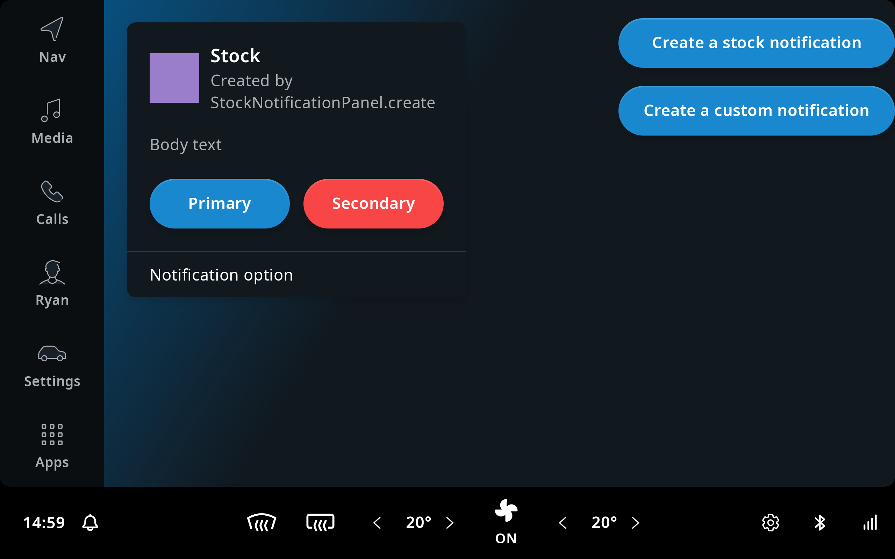
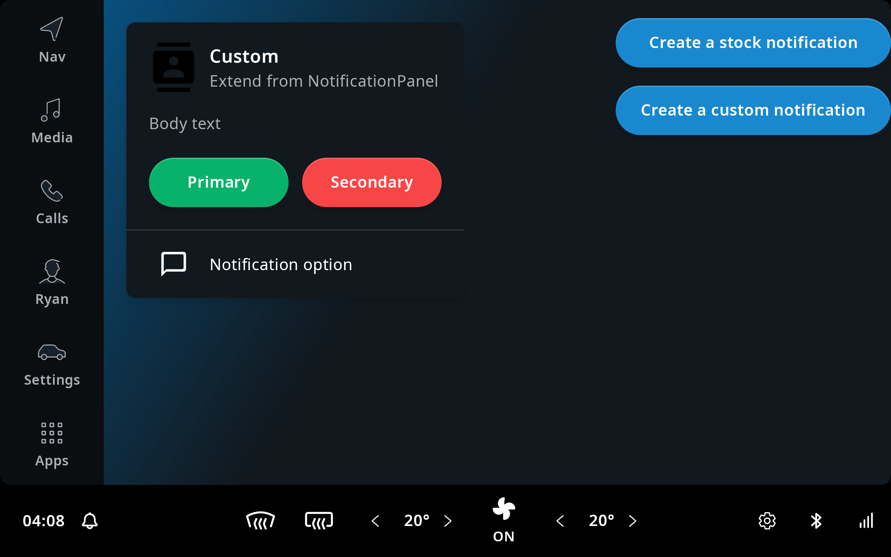

A notification itself is a panel, and a panel needs an [`IviFragment`](TTIVI_INDIGO_API) and a
[`FrontendViewModel`](TTIVI_INDIGO_API) for the creation.

To create notifications, you need:

- [`NotificationPanel`](TTIVI_INDIGO_API)
- [`NotificationFragment`](TTIVI_INDIGO_API)
- [`NotificationViewModel`](TTIVI_INDIGO_API)

TomTom IndiGO provides clients different ways for the notification creation. You can either use:

- [`StockNotificationPanel`](TTIVI_INDIGO_API) to create a notification;
- or implement a [`NotificationPanel`](TTIVI_INDIGO_API) yourself.

The next sections explain the different ways to create a notification.
  
## Create a Stock Notification Panel

[`StockNotificationPanel`](TTIVI_INDIGO_API) is a notification panel which can only be created by
[`StockNotificationPanel`](TTIVI_INDIGO_API)`.create`. You don't need to derive
[`NotificationPanel`](TTIVI_INDIGO_API), [`NotificationFragment`](TTIVI_INDIGO_API), and
[`NotificationViewModel`](TTIVI_INDIGO_API) yourself. You can just focus on providing data for the
content.

The example below creates a notification when you click on the button. It demonstrates how you can
create it by using [`StockNotificationPanel`](TTIVI_INDIGO_API)`.create`.

```kotlin
import androidx.lifecycle.LiveData
import com.tomtom.ivi.platform.frontend.api.common.frontend.panels.NotificationPanel
import com.tomtom.ivi.platform.frontend.api.common.frontend.viewmodels.FrontendViewModel
import com.tomtom.ivi.platform.frontend.api.template.notificationpanel.NotificationViewModel
import com.tomtom.ivi.platform.frontend.api.template.notificationpanel.stock.StockNotificationPanel
import com.tomtom.tools.android.api.livedata.ImmutableLiveData
import com.tomtom.tools.android.api.resourceresolution.drawable.ResourceDrawableResolver
import com.tomtom.tools.android.api.resourceresolution.string.StaticStringResolver
import com.tomtom.tools.android.api.resourceresolution.string.StringResolver
import com.tomtom.tools.android.api.uicontrols.button.TtButton
import com.tomtom.tools.android.api.uicontrols.button.TtButtonViewModel
import com.tomtom.tools.android.api.uicontrols.imageview.ImageDescriptor

internal class NotificationCreationViewModel(panel: NotificationCreationPanel) :
    FrontendViewModel<NotificationCreationPanel>(panel) {

    fun onStockNotificationButtonClicked() =
        panel.addPanel(
            StockNotificationPanel.create {
                frontendContext = panel.frontendContext
                priority = NotificationPanel.Priority.HIGH
                headerViewModel = HEADER
                bodyText = BODY_TEXT
                primaryActionButtonViewModel = PRIMARY_BUTTON
                secondaryActionButtonViewModel = SECONDARY_BUTTON
                optionViewModels = NOTIFICATION_OPTIONS
            }
        )

    private companion object {
        val HEADER = NotificationViewModel.HeaderViewModel(
            imageDescriptor = ImageDescriptor(
                ResourceDrawableResolver(R.drawable.ttivi_notification_icon_placeholder)
            ),
            title = StaticStringResolver("Stock"),
            description = StaticStringResolver("Created by StockNotificationPanel.create")
        )

        val BODY_TEXT: LiveData<StringResolver?> =
            ImmutableLiveData(StaticStringResolver("Body text"))

        val PRIMARY_BUTTON: LiveData<TtButtonViewModel?> = ImmutableLiveData(
            TtButtonViewModel(
                text = ImmutableLiveData(StaticStringResolver("Primary")),
                actionType = ImmutableLiveData(TtButton.ActionType.PRIMARY)
            )
        )

        val SECONDARY_BUTTON: LiveData<TtButtonViewModel?> = ImmutableLiveData(
            TtButtonViewModel(
                text = ImmutableLiveData(StaticStringResolver("Secondary")),
                actionType = ImmutableLiveData(TtButton.ActionType.DESTRUCTIVE)
            )
        )

        val NOTIFICATION_OPTIONS = ImmutableLiveData(
            listOf(
                NotificationViewModel.OptionViewModel(
                    description = ImmutableLiveData(
                        StaticStringResolver("Notification option")
                    )
                )
            )
        )
    }
}
```



## Implement your own [`NotificationPanel`](TTIVI_INDIGO_API)

If you need more complex logic for notifications, for example extra actions to be performed when a
notification is dismissed, you can implement [`NotificationPanel`](TTIVI_INDIGO_API) yourself. The
example below is similar to the previous one, except we choose to implement
[`NotificationPanel`](TTIVI_INDIGO_API) manually.

```kotlin
import androidx.lifecycle.LiveData
import com.tomtom.ivi.platform.frontend.api.common.frontend.FrontendContext
import com.tomtom.ivi.platform.frontend.api.common.frontend.IviFragment
import com.tomtom.ivi.platform.frontend.api.common.frontend.panels.NotificationPanel
import com.tomtom.ivi.platform.frontend.api.template.notificationpanel.NotificationFragment
import com.tomtom.ivi.platform.frontend.api.common.frontend.viewmodels.FrontendViewModel
import com.tomtom.ivi.platform.frontend.api.template.notificationpanel.NotificationViewModel
import com.tomtom.tools.android.api.livedata.ImmutableLiveData
import com.tomtom.tools.android.api.resourceresolution.drawable.ResourceDrawableResolver
import com.tomtom.tools.android.api.resourceresolution.string.StaticStringResolver
import com.tomtom.tools.android.api.resourceresolution.string.StringResolver
import com.tomtom.tools.android.api.uicontrols.button.TtButton
import com.tomtom.tools.android.api.uicontrols.button.TtButtonViewModel
import com.tomtom.tools.android.api.uicontrols.imageview.ImageDescriptor

internal class NotificationCreationViewModel(panel: NotificationCreationPanel) :
    FrontendViewModel<NotificationCreationPanel>(panel) {

    fun onCustomNotificationButtonClicked() =
        panel.addPanel(ExampleNotificationPanel(panel.frontendContext))
}

internal class ExampleNotificationPanel(
    frontendContext: FrontendContext
) : NotificationPanel(frontendContext, Priority.HIGH) {

    override fun createInitialFragmentInitializer() =
        IviFragment.Initializer(
            NotificationFragment(ExampleNotificationViewModel::class),
            this
        )

    override fun onDismissed() {
        super.onDismissed()

        onDismissedAction()
    }

    private fun onDismissedAction() {
        // Things to be executed when the panel is dismissed.
    }
}

internal class ExampleNotificationViewModel(panel: ExampleNotificationPanel) :
    NotificationViewModel<ExampleNotificationPanel>(panel){

    override val headerViewModel = HeaderViewModel(
        imageDescriptor = ImageDescriptor(
            ResourceDrawableResolver(R.drawable.ttivi_notification_icon_alternative_placeholder)
        ),
        title = StaticStringResolver("Custom"),
        description = StaticStringResolver("Extend from NotificationPanel")
    )

    override val bodyText: LiveData<StringResolver?> =
        ImmutableLiveData(StaticStringResolver("Body text"))

    override val primaryActionButtonViewModel: LiveData<TtButtonViewModel?> =
        ImmutableLiveData(
            TtButtonViewModel(
                text = ImmutableLiveData(StaticStringResolver("Primary")),
                actionType = ImmutableLiveData(TtButton.ActionType.ACCEPTANCE),
                onClick = { onPrimaryButtonClicked() }
            )
        )

    private fun onPrimaryButtonClicked() {
        // Things to be executed when the primary button is clicked.
    }

    override val secondaryActionButtonViewModel: LiveData<TtButtonViewModel?> = ImmutableLiveData(
        TtButtonViewModel(
            text = ImmutableLiveData(StaticStringResolver("Secondary")),
            actionType = ImmutableLiveData(TtButton.ActionType.DESTRUCTIVE),
            onClick = { onSecondaryButtonClicked() }
        )
    )

    private fun onSecondaryButtonClicked() {
        // Things to be executed when the secondary button is clicked.
    }

    override val optionViewModels: LiveData<List<OptionViewModel>> = ImmutableLiveData(
        listOf(
            OptionViewModel(
                imageDescriptor = ImmutableLiveData(
                    ImageDescriptor(
                        ResourceDrawableResolver(R.drawable.ttivi_notificationoption_icon_placeholder)
                    ),
                ),
                description = ImmutableLiveData(
                    StaticStringResolver("Notification option")
                ),
            )
        )
    )
}
```


