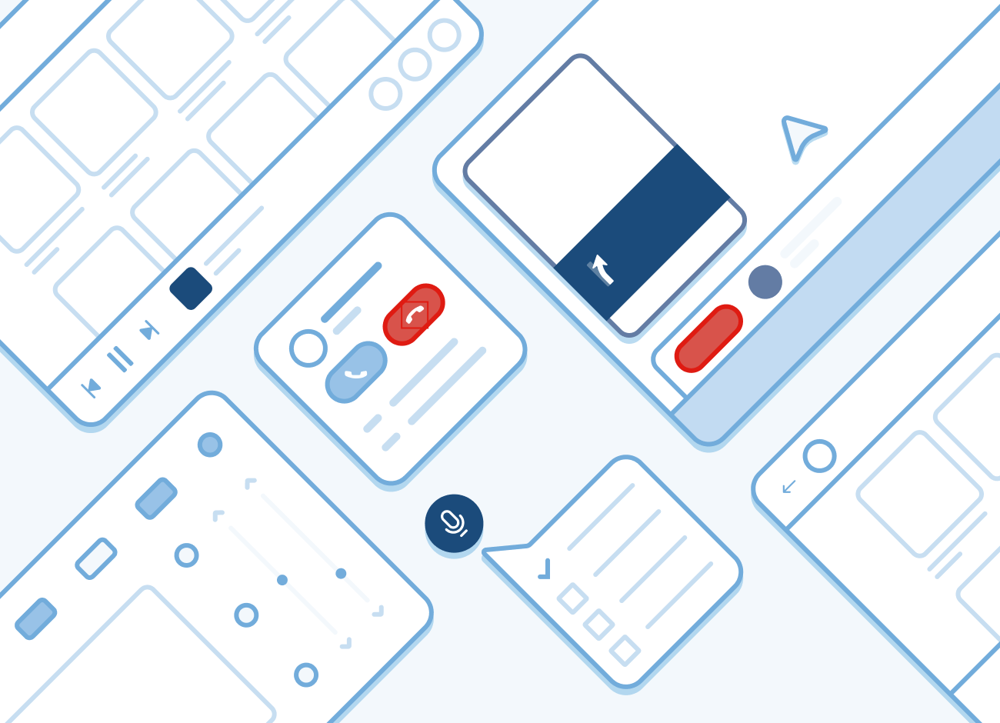
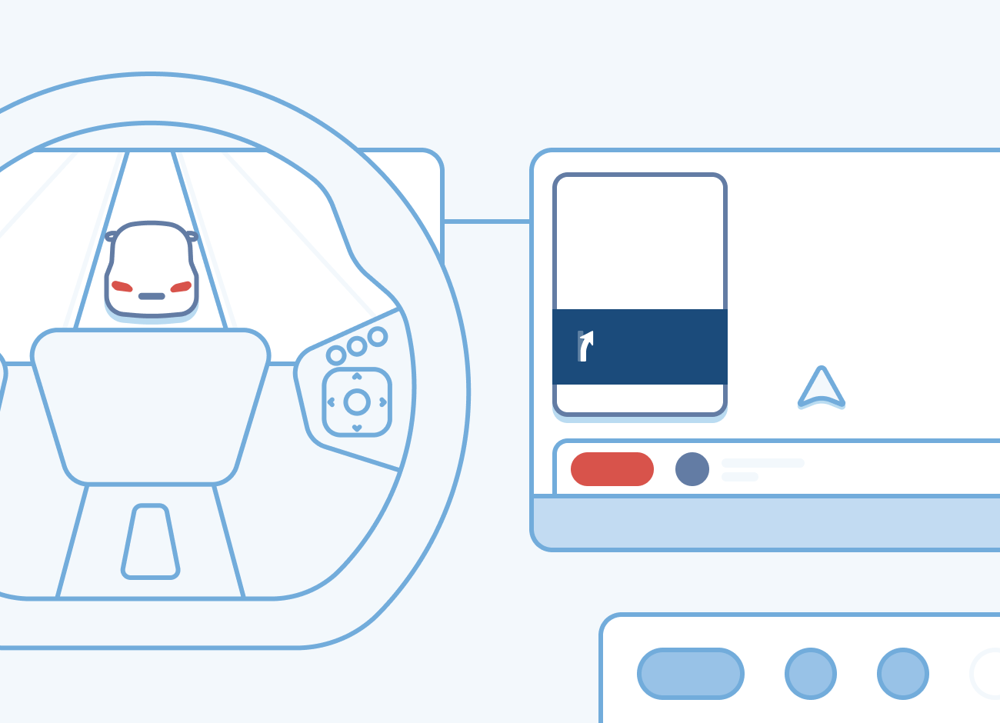
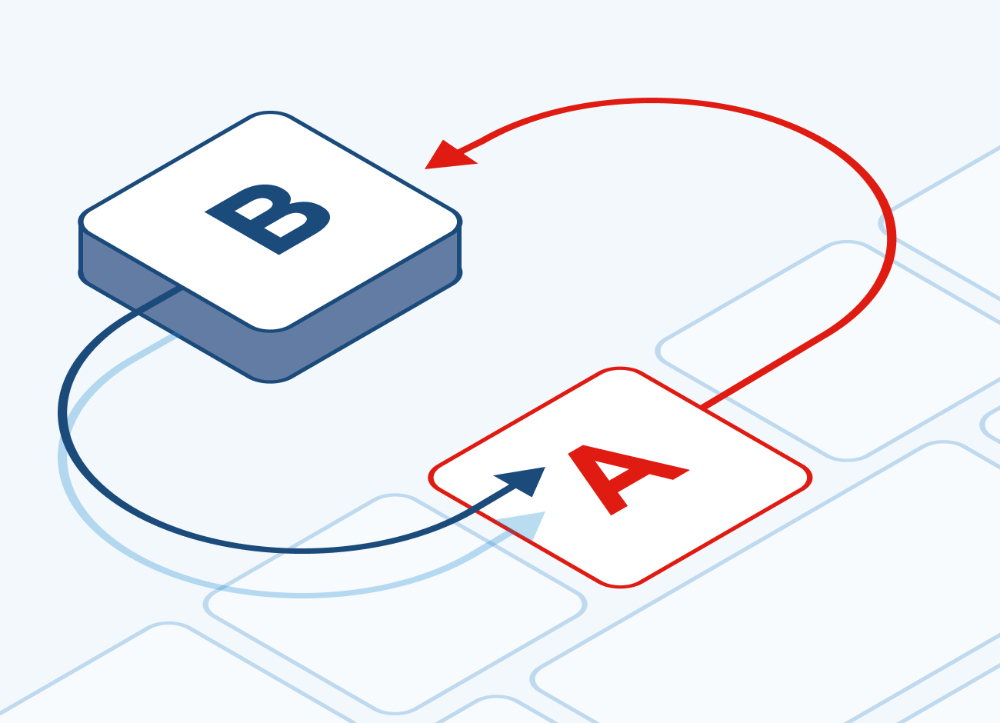

    <iframe 
        src="https://player.vimeo.com/video/649985038?h=5a2fa675b4&title=0&portrait=0&color=44ABE0" 
        style="position:absolute;top:0;left:0;width:100%;height:100%;" 
        frameborder="0" 
        allow="autoplay; fullscreen; picture-in-picture" 
        allowfullscreen>
    </iframe>

    

        
<a href="https://www.tomtom.com/products/indigo/">IndiGO</a> is a framework to deliver Android-based digital cockpits. 
        It includes an application platform to support the development of highly integrated applications on top of Android Automotive. 
        It also offers a complete set of industrial strength end-user applications, that can be customized to the needs of a car maker.

        
Take the in-car experience to new places and get started with our comprehensive SDK that includes APIs, supporting documentation and code examples.

        <button
            onclick="location.href='/indigo/documentation/platform-overview'"
            style="background-color:#df1b12; color:white; border:none; padding:10pt; width:30%; font-weight:bold">
            PLATFORM OVERVIEW
        </button>
    

    

    
    

    

    <h2>IndiGO Example App</h2>
    
The example app showcases IndiGO&#39;s stock experiences, and provides a good starting point for IndiGO development.

    <button 
        onclick="location.href='/indigo/documentation/platform-overview/example-app'"
        style="background-color:#df1b12; color:white; border:none; padding:10pt; width:50%; font-weight:bold">
        EXPLORE
    </button>
    

    

    
    

    

    <h2>Developing with IndiGO</h2>
    
Get your development environment ready and create your first custom experience.

    <button 
        onclick="location.href='/indigo/documentation/getting-started/introduction'"
        style="background-color:#df1b12; color:white; border:none; padding:10pt; width:50%; font-weight:bold">
        GET STARTED
    </button>
    

    

    
    

    

    <h2>How to extend</h2>
    
Learn how IndiGO can be extended and how to integrate deeply into the ecosystem.

    <button 
        onclick="location.href='/indigo/documentation/development/frontend-plugins'"
        style="background-color:#df1b12; color:white; border:none; padding:10pt; width:50%; font-weight:bold">
        CREATE PLUGIN
    </button>
    

